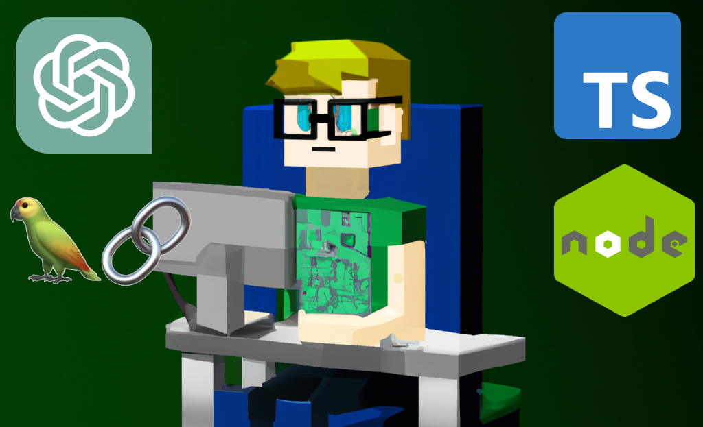

# Taylor the Junior Dev!
## AKA Code-Voyager

An implementation of MineDojo's [Voyager](https://voyager.minedojo.org/) focused on closing Github issues instead of playing Minecraft.

## What makes this agent so special?
Taylor ~~steals~~ builds upon Voyager's architecture to complete long-horizon tasks better than other LLM-powered agents. This includes:
* 🧾 Dynamic task decomposition based on both the initial Github issue and past successes/failures
* 👾 Custom code-generation agent that explores your Github repo in order to write more applicable code
* ✅ Self-validation both by traditional methods (compiler checks, linting, etc) and with an LLM

This agent also interfaces _entirely through Github!_ As a Github app, Taylor automatically:
* Starts work on Issues as soon as they are submitted
* Clones the repo, forks a new branch, and commits to this new branch only
* Creates a pull request when they believe the issue is resolved.

## Tech Stack:
* 💾 Node.js + Typescript
* 📲 Express.js for the API
* 🦜 Langchain.js to interface with the LLM stuff
* 🤖 OpenAI APIs for the LLM

# This is version 0.1- it barely works 😅
Some things it can do:
- [x] Connect to a repo as a Github app
- [x] Fetch an issue, decompose it into a clear task, and assign that task to the code generation agent
- [x] Commit and open a PR when the code generation is finished

## Things to come in version 0.2
- [ ] Self-verification agent that doesn't rubber-stamp approve everything
- [ ] Return lint errors back to the code generator without failing the task
- [ ] Set up logging on a per-task basis to add environmental data to each chain
- [ ] Vector database based off of the repo code + library documentation
- [ ] Skills library and retriever (like Voyager)
- [ ] Move model configs from hardcoded to .env vars
- [ ] Meet with a skilled backend JS dev to talk about better ways to structure the app to reduce duplicate code

## Things saved for version 0.3 and onwards
- [ ] Dockerized app
- [ ] Unit tests for each route
- [ ] Internet search retriever (maybe)
- [ ] Experiment with other models for each task
    - I'm _super_ interested in trying out code-specific LLMs like StarCoder, and that 2.7B Ghostwriter.
- [ ] Documentation about how to get your own Taylor server up and running
- [ ] Extreme dogfooding- add Taylor to this repo and have the agent improve its own code

## Other Notes 'N Stuff
> Do we _have_ to require the LLM to write Javascript? Like, the code it writes will only be consuming APIs. It'll write additional code in strings, but there's no set reason why it has to use JS/TS to call those APIs, right?
* Web research retriever
    - will need to implement on your own with https://serpapi.com/integrations/node and LLM chain
* HNSWlib indices https://js.langchain.com/docs/modules/data_connection/vectorstores/integrations/hnswlib
    - node_modules/.bin/jsdoc -c jsdoc.conf.json -X ./src > jsdoc-ast.json
    - consider what metadata to filter on https://js.langchain.com/docs/modules/data_connection/retrievers/how_to/self_query/hnswlib-self-query
* Consider also just doing a standard postgres database with PGVector. It will work better with scale anyways, and you can have a different (persistent) table for each repo. 
* Since this "bot" makes calls to models on external systems, can I run this on a free GCP VM? Or an old iPhone?